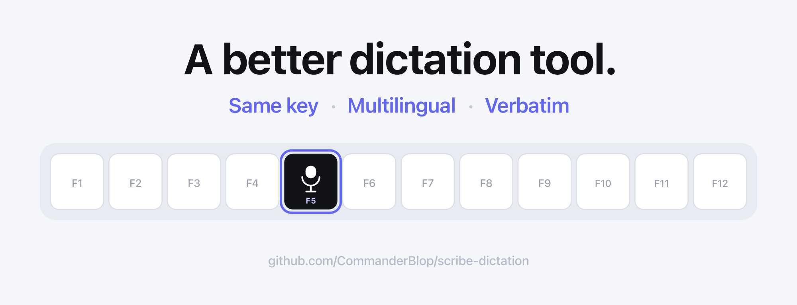
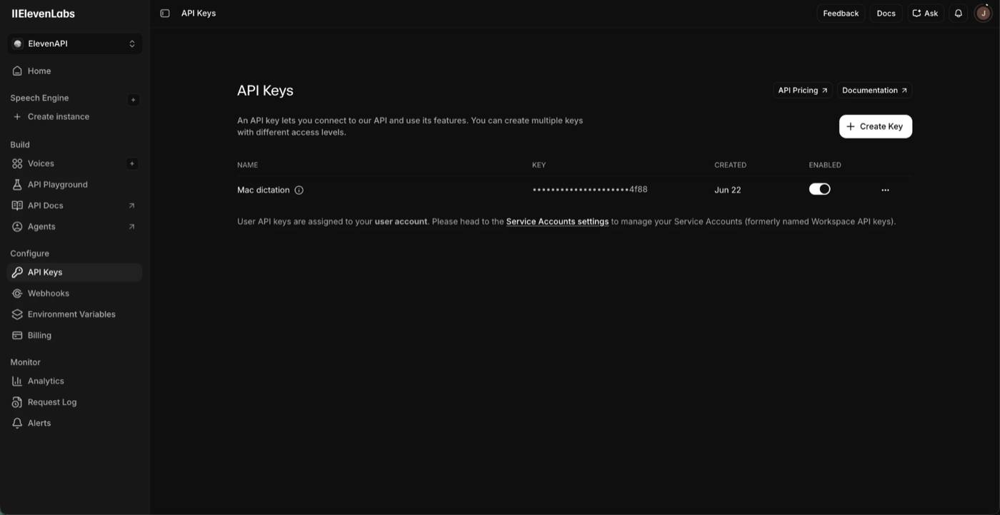

# Scribe Dictation

<p align="center">
  
</p>

System-wide push-to-talk dictation for macOS that replaces Apple Dictation with
**[ElevenLabs Scribe v2](https://elevenlabs.io/realtime-speech-to-text)**.

Press a hotkey, speak, and your words are transcribed and pasted at the cursor —
in any app (Claude desktop, browser, editor, anywhere a text field is focused).

## Why this exists

It was built for two specific needs:

1. **Verbatim transcription for interview practice and debriefs.** No filler-word
   stripping, no rewriting — you see exactly how you actually spoke, because delivery
   matters as much as content when you're thinking out loud under pressure. Most
   dictation tools clean up your speech by default; this one deliberately doesn't.
2. **Frictionless mixed Chinese/English dictation** for dumping ideas and debriefing
   at the speed of thought, without a tool fighting your choice of language.

**Why Scribe v2?** Its smart language detection handles **mixed-language speech**
out of the box. You can speak Chinese and English in the same sentence and it
transcribes both correctly — something Apple Dictation forces you to fight with a
fixed language setting.

It's a single [Hammerspoon](https://www.hammerspoon.org/) config file plus `sox`
for recording. Two modes:

- **Fn+F5 — realtime mode** (default): stream the mic to Scribe v2 Realtime over a
  WebSocket and paste each segment as you pause.
- **Fn+F4 — paragraph mode** (fallback): record, then transcribe the whole
  utterance at once. Simple and reliable; text appears a moment after you stop.

> **On Windows?** An experimental port (AutoHotkey + Python) is in
> [`windows/`](windows/README.md) — paragraph mode works via `Ctrl+Shift+Space`.
> It's early and untested; feedback welcome.

---

## How it works

```
Fn+F5: hotkey ─► stream mic (sox) ─► Scribe v2 Realtime (WS) ─► paste each segment
Fn+F4: hotkey ─► record mic (sox) ─► Scribe v2 (REST) ──────► paste whole text
```

1. Hotkey → `sox` captures your mic.
2. Paragraph mode POSTs the WAV to the REST endpoint; realtime streams PCM chunks
   over the WebSocket.
3. Returned text is placed on the clipboard and pasted with ⌘V at the cursor.

---

## Requirements

- macOS (tested on Apple Silicon)
- [Homebrew](https://brew.sh/)
- An [ElevenLabs](https://elevenlabs.io/) account + API key (2-min setup below)

---

## Getting your ElevenLabs API key

The one part of setup that happens outside this tool — about 2 minutes:

1. Create an account at **[elevenlabs.io](https://elevenlabs.io/)**.
2. Open **[elevenlabs.io/app/api](https://elevenlabs.io/app/api)** — i.e. **Developers →
   API Keys** in the left sidebar (it's in the developer/API area, *not* your public profile).
3. Click **Create API Key**.
4. Enable the **Speech to Text** permission (required). Optionally also enable
   **User → Read** — only for the little "credits left" popup after each dictation.
5. **Copy the key** (it starts with `sk_`). You'll paste it once, during install.

> **Cost:** the **$6/month Starter plan** (30,000 credits ≈ 27 hours of transcription)
> is plenty for heavy daily use. The free tier is fine for trying it out.

**The API Keys page** (Developers → API Keys) — click **Create Key**:



**Set the key's permissions** — turn on **Speech to Text** (required); add **User → Read**
too if you want the "credits left" popup after each dictation:


---

## Install

### Option A — one command (recommended) ⭐

First, [get your API key](#getting-your-elevenlabs-api-key) (above) — keep it handy.

1. **Open Terminal:** press `⌘ Space`, type `Terminal`, press Return.
2. **Paste this line, press Return,** and follow the prompts:

```bash
/bin/bash -c "$(curl -fsSL https://raw.githubusercontent.com/CommanderBlop/scribe-dictation/main/install.sh)"
```

It installs everything (Homebrew, sox, Hammerspoon, the tool), asks you to **paste
your API key**, opens Accessibility settings, and reloads Hammerspoon for you.

Two macOS permissions — **one now, one on first use**:

- **Accessibility** *(grant now)* — turn on "Hammerspoon" in the Settings window that
  opened (use **+** to add it if it isn't listed). Lets it paste at your cursor; that's its only use.
- **Microphone** *(on first use)* — you can't set it yet; the first time you dictate,
  macOS asks *"Hammerspoon wants to use the Microphone."* Click **Allow**. Nothing else is accessed.

**Then test it (10 seconds):** click into any text box, press **Fn+F5** (a 🟢 appears
in the menu bar), and start speaking — click **Allow** if macOS asks for the mic. Each
finalized segment lands at the cursor as you pause; press **Fn+F5** again to stop.

> On most Macs the function row is media keys, so **single F5 is Apple Dictation** —
> you press **Fn+F5**. If the first press seems to do nothing, see
> [Troubleshooting](#troubleshooting).

---

<details>
<summary><b>Option B — manual, step by step</b> (click to expand)</summary>

<br>

Prefer to see every step (or the one-liner failed)? Same result, by hand. Steps 1–2
are copy-paste; 3–4 need a few clicks. Realtime mode (Fn+F5) needs the small Python
setup in step 6; paragraph mode (Fn+F4) works with only Hammerspoon and sox.

> **Open Terminal:** press `⌘ Space`, type "Terminal", hit Return.

#### 1. Install Homebrew + dependencies

If you don't already have [Homebrew](https://brew.sh/) (check with `brew --version`):

```bash
/bin/bash -c "$(curl -fsSL https://raw.githubusercontent.com/Homebrew/install/HEAD/install.sh)"
```

Then install the two things this tool needs — `sox` (records the mic) and
Hammerspoon (the automation app that holds the hotkeys):

```bash
brew install sox
brew install --cask hammerspoon
```

> On **Intel** Macs, Homebrew lives at `/usr/local`, so `sox` is
> `/usr/local/bin/sox`. Run `which sox` and, if it differs, update `M.sox` (and
> the `PATH` in the realtime env) in `init.lua`.

#### 2. Get the code and install the config

```bash
git clone https://github.com/CommanderBlop/scribe-dictation.git ~/projects/scribe-dictation
cd ~/projects/scribe-dictation
mkdir -p ~/.hammerspoon
cp init.lua ~/.hammerspoon/init.lua
```

> ⚠️ Already a Hammerspoon user? `cp` overwrites your `~/.hammerspoon/init.lua`.
> Instead save it as `~/.hammerspoon/scribe.lua` and add `require("scribe")` to your
> existing `init.lua`.

#### 3. Add your API key

Create a key at **[elevenlabs.io/app/api](https://elevenlabs.io/app/api)** (Developers → API Keys)
(it needs the **Speech to Text** permission; add **User → Read** for the credit
toast). Then store it — from the repo folder:

```bash
bash set-key.sh
```

It validates the key and saves it to your macOS **Keychain** (encrypted), which
`init.lua` reads automatically. **To change the key later, just run `set-key.sh`
again** — nothing else to touch. (Prefer not to use the Keychain? See
[Store the key once](#store-the-key-once) for the env-var and hardcode options.)

#### 4. Launch Hammerspoon and grant permissions

```bash
open -a Hammerspoon
```

Grant Hammerspoon two permissions in **System Settings → Privacy & Security**
(toggle it on under each; add it with `+` if it's not listed):

| Permission        | Why (and nothing more)                                   |
|-------------------|----------------------------------------------------------|
| **Accessibility** | Simulate ⌘V to paste text at your cursor — the only use  |
| **Microphone**    | Let `sox` record your voice (prompts on first use)       |

#### 5. Reload and dictate

Click the Hammerspoon **🔨** in the menu bar → **Reload Config**. You'll see a
"Scribe loaded" notification. Now focus any text field (Claude, browser, notes…),
press **Fn+F4**, speak a sentence, and press **Fn+F4** again — the text is pasted at
the cursor.

> 🔴 = recording, ⏳ = transcribing, nothing = idle. This is the paragraph fallback;
> realtime uses Fn+F5 and shows 🟢 while it is streaming.

#### 6. Enable realtime mode

For live, segment-by-segment dictation on **Fn+F5**, do the one-time Python setup in
the [Realtime mode](#realtime-mode-fnf5) section below. The recommended one-command
installer does this automatically.

</details>

---

<details>
<summary><b>Store the key once</b> — env-var / Keychain-by-hand / hardcode options (click to expand)</summary>

<br>

Instead of hardcoding the key, keep it in **one place**. `init.lua` resolves it at
load, first match wins:

1. `$ELEVENLABS_API_KEY` (environment)
2. the hardcoded `M.apiKey` literal
3. the macOS **Keychain** (service `M.keychainService`, default `elevenlabs-api`)

Pick one of the two "set once" options below — Keychain is the most secure.

### Keychain — recommended (encrypted, app-scoped)

**`set-key.sh` already does this for you** (the installer runs it). To do it by
hand, or to change the key later:

```bash
bash set-key.sh
# or directly:
security add-generic-password -a "$USER" -s elevenlabs-api -T /usr/bin/security -w sk-your-key-here -U
```

Leave `M.apiKey` as the placeholder and reload Hammerspoon. The key is stored
encrypted, not in any plaintext file (the `-T` flag lets Hammerspoon read it back
without a prompt). For the **terminal** too (e.g. running the realtime engine by
hand), derive it from the same source:

```bash
export ELEVENLABS_API_KEY="$(security find-generic-password -s elevenlabs-api -w 2>/dev/null)"
```

Rotate by re-running the `add-generic-password … -U` line with the new key, then
reload Hammerspoon. Nothing else to change.

### LaunchAgent env var — convenient, but least private

A login LaunchAgent that runs `launchctl setenv` makes the key a GUI-visible,
persistent environment variable:

```xml
<?xml version="1.0" encoding="UTF-8"?>
<!DOCTYPE plist PUBLIC "-//Apple//DTD PLIST 1.0//EN" "http://www.apple.com/DTDs/PropertyList-1.0.dtd">
<plist version="1.0"><dict>
  <key>Label</key><string>com.scribe.elevenlabs-key</string>
  <key>ProgramArguments</key>
  <array>
    <string>launchctl</string><string>setenv</string>
    <string>ELEVENLABS_API_KEY</string><string>sk-your-key-here</string>
  </array>
  <key>RunAtLoad</key><true/>
</dict></plist>
```

```bash
chmod 600 ~/Library/LaunchAgents/com.scribe.elevenlabs-key.plist
launchctl load -w ~/Library/LaunchAgents/com.scribe.elevenlabs-key.plist
launchctl setenv ELEVENLABS_API_KEY sk-your-key-here   # now, no reboot needed
```

Then **fully quit and reopen Hammerspoon** (a Reload isn't enough — env is inherited
at launch). Shell side: `export ELEVENLABS_API_KEY="$(launchctl getenv ELEVENLABS_API_KEY 2>/dev/null)"`.

> ⚠️ `launchctl setenv` publishes the key to your **whole login session** — *any*
> process you run can read it with `launchctl getenv`, and the plist holds it in
> plaintext. That's broader exposure than the Keychain or a `chmod 600` init.lua.
> Prefer the Keychain unless you specifically need a shared env var.

</details>

---

## Hotkeys

| Action                          | Default  | Config field    |
|---------------------------------|----------|-----------------|
| Realtime mode (stream → paste)  | `Fn+F5`  | `M.realtimeKey` |
| Paragraph mode (record → paste) | `Fn+F4`  | `M.toggleKey`   |

Press once to start, press again to stop. The two modes are mutually exclusive —
while one is active, the other key is ignored. 🔴/⏳ shows in the menu bar for
paragraph mode, 🟢 for realtime.

### About the Fn+F5 key

On keyboards where the function row is media keys (the default), **single F5** is
the 🎤 Apple Dictation key, while **Fn+F5** sends a real F5 keycode. This config
binds plain `f5`, so **press Fn+F5** to dictate — no system settings to change, and
no conflict with Apple Dictation on single F5.

Prefer a bare F5 (no Fn)? Turn on *System Settings → Keyboard → Keyboard Shortcuts
→ Function Keys → "Use F1, F2, etc. as standard function keys"*, and optionally turn
off Apple Dictation so single F5 is free.

Want a different key/combo? Edit `M.realtimeKey` or `M.toggleKey`, e.g.
`{ mods = {"cmd","alt"}, key = "d" }`.

---

## Configuration

All settings live at the top of `init.lua`:

| Field            | Default                | Notes |
|------------------|------------------------|-------|
| `M.apiKey`       | env or placeholder     | Your ElevenLabs API key |
| `M.modelId`      | `"scribe_v2"`          | `scribe_v1` also available |
| `M.sox`          | `/opt/homebrew/bin/sox`| Path to the `sox` binary |
| `M.maxSecs`         | `120`               | Auto-stop after N seconds |
| `M.toggleKey`       | `Fn+F4`             | Paragraph mode; press to start / press again to stop |
| `M.languageCode`    | `nil`               | `nil` = auto-detect; or force `"zh"`, `"en"`, … |
| `M.showCredits`     | `true`              | Show a credit toast after each transcription |
| `M.creditsPerMinute`| `18.7`              | Credits/min for paragraph mode estimate (plan-dependent) |
| `M.creditsPerMinuteRealtime`| `33.2`      | Credits/min for realtime estimate (realtime is ~1.77× pricier) |
| `M.proxy`           | `"auto"`            | `"auto"` follows the macOS system proxy; or an explicit `"http://127.0.0.1:7890"`; or `nil` for direct. Used only when the proxy is actually listening, else direct |
| `M.realtimeKey`     | `Fn+F5`             | Realtime streaming toggle (`nil` to disable) |
| `M.pyProject`       | `~/projects/scribe-dictation` | Path to this repo (has `.venv` + `realtime/`) |
| `M.realtimeSilenceSecs` | `0.6`           | Pause length that finalizes a realtime segment (lower = faster) |
| `M.realtimeVadThreshold`| `0.4`           | Speech-vs-silence sensitivity 0-1; higher ignores ambient noise (closes sooner) |
| `M.realtimeIdleSecs`| `30`                | Auto-close realtime after N seconds with no new text (`0` = off) |
| `M.timer`           | `false`             | Practice mode: insert `⏱ M:SS · N words` pacing markers into the transcript |
| `M.timerIntervalSecs`| `60`               | Seconds between pacing markers when `M.timer` is on (e.g. `300` for 5-min) |

Leave `M.languageCode = nil` to get the mixed-language auto-detection that makes
Scribe worth using.

> **Practice mode (pacing timer).** For interview / public-speaking practice, turn
> on **🎙️ menu-bar → Pacing timer** (and pick an interval) to drop a marker into the
> transcript every minute so you can see your words-per-minute. The menu-bar dropdown
> is a small settings panel — its toggles persist via `hs.settings` (no file editing,
> and a `git pull` won't reset them); `M.timer` / `M.timerIntervalSecs` are just the
> first-run defaults. The marker is placed at the exact word where the minute ticks
> (via the API's word timestamps), so per-minute counts are accurate; it appears when
> that segment commits (on your next pause), not exactly on the second. Off by default
> since it writes markers into your text.

> **Menu-bar panel & reopening.** The menu-bar dot (⚪ idle · 🟢 realtime · 🔴
> paragraph) is a small settings panel — the toggles above plus **Set / update API
> key…** (a masked prompt that writes to your Keychain, picked up on the next
> dictation). If you ever quit Hammerspoon, reopen **Hammerspoon** (Spotlight →
> "Hammerspoon") — it reloads this config on launch. Tick Hammerspoon → Preferences →
> *Launch Hammerspoon at login* so the ⚪ is always there.

---

## Realtime mode (Fn+F5)

Paragraph mode (Fn+F4) works with nothing but Hammerspoon + sox. Realtime mode adds
live, segment-by-segment dictation by streaming to **Scribe v2 Realtime** over a
WebSocket. It uses a small Python engine, so it needs a one-time venv:

```bash
cd ~/projects/scribe-dictation          # wherever you cloned this repo
python3 -m venv .venv
.venv/bin/pip install -r realtime/requirements.txt
```

Point `M.pyProject` at that folder. Then press **Fn+F5** to start streaming (🟢),
speak, and each finalized segment is pasted as you pause; press Fn+F5 again to stop.
Details and troubleshooting: [realtime/README.md](realtime/README.md).

> Realtime is billed at **$0.39/audio-hour** (≈1.77× paragraph mode). The credit
> toast uses `M.creditsPerMinuteRealtime` for its estimate.

---

## Credit usage display

When `M.showCredits = true`, after each transcription a toast shows roughly:

```
💳 ~6 credits (12.4s) · 28,990 left
```

- **Remaining** is read live from `GET /v1/user/subscription` (`character_limit −
  character_count`). This needs the API key to have the **User → Read**
  (`user_read`) permission. Without it, the call is skipped silently — dictation
  still works, you just don't get the toast.
- **This clip's cost** is an *estimate* (`~`), computed from the recording length ×
  `M.creditsPerMinute`. ElevenLabs settles real usage with a ~50s delay, so an exact
  per-clip number isn't available immediately — the duration estimate is instant and
  close.

**The rate is plan-dependent.** ElevenLabs officially bills Scribe v1/v2 at
**$0.22 per audio hour, per minute** (not per token). The credits-per-minute then
depends on your plan's credit pool:

| Plan    | Credits / month | Included Scribe hours | ≈ credits / min |
|---------|-----------------|-----------------------|-----------------|
| Starter | 30,276          | 27 h                  | **18.7**        |
| Creator | 100,000         | 100 h                 | **16.7**        |

Set `M.creditsPerMinute` to match your plan. To verify empirically: note
`character_count` from the subscription endpoint, transcribe a clip of known length,
**wait ~1 minute** (usage settles with a delay), read it again, and divide the
credit difference by the minutes of audio. (Scribe v2 *Realtime* is pricier —
$0.39/hr — so its per-minute credit rate is ~1.8× the batch figures above.)

Set `M.showCredits = false` to disable the toast (and the extra API call) entirely.

---

## Troubleshooting

Open the Hammerspoon **Console** (menu-bar hammer → Console) to see logs.

| Symptom | Likely cause |
|---------|--------------|
| Nothing pastes | Accessibility permission not granted to Hammerspoon |
| No 🟢/🔴, or no audio | Grant **Microphone** when macOS prompts on your first dictation; or wrong `M.sox` path |
| `Scribe API: ...` alert | Bad/expired API key, or out of credits |
| "empty/unexpected response" | Check Console for the raw response printed below it |
| `curl failed (28)` timeout | Network needs a proxy — Hammerspoon (GUI) doesn't see your shell's proxy vars. Set `M.proxy` |
| **Realtime (Fn+F5) won't connect, but paragraph (Fn+F4) works** | Common behind a proxy / in a restricted region (e.g. mainland China): realtime uses a WebSocket that a direct connection may block, while batch REST still gets through. `M.proxy = "auto"` (the default) follows your macOS **system proxy** automatically. If your proxy runs in TUN/transparent mode (no system proxy set — e.g. some Clash setups), scutil can't see it: set an explicit `M.proxy = "http://127.0.0.1:7890"`. Fn+F4 is the reliable fallback. |
| Fn+F5 does nothing at all | Confirm the realtime venv exists (`~/projects/scribe-dictation/.venv`); on a media-key keyboard use **Fn**+F5, or remap `M.realtimeKey` |

---

## Roadmap ideas

- ✅ Real-time streaming via Scribe v2 Realtime (WebSocket) — see [realtime/](realtime/README.md)
- `keyterms` support to bias domain vocabulary / names
- Native Swift menu-bar app for status, auto-launch, and device selection
- Pure-Lua realtime (drop the Python engine) if `hs.websocket` gains header auth

---

## Uninstall

One command (it asks before removing anything shared, like the Hammerspoon app):

```bash
/bin/bash -c "$(curl -fsSL https://raw.githubusercontent.com/CommanderBlop/scribe-dictation/main/uninstall.sh)"
```

It quits Hammerspoon, removes/restores `~/.hammerspoon/init.lua`, removes the
optional key LaunchAgent + the `~/.zshrc` line, and offers to delete the cloned
repo and the brew tools. Homebrew itself is left alone. You should still **revoke
the API key** at elevenlabs.io and clear "Hammerspoon" from Accessibility /
Microphone in System Settings if you removed the app.

---

## Security note

If you paste your key into `init.lua` it's stored in plaintext, so the installer
`chmod 600`s the file. Either way, **never commit a real key** — the `init.lua`
in this repo ships with a placeholder; keep it that way. For the least exposure,
use the Keychain option in [Store the key once](#store-the-key-once).

---

## License

MIT
